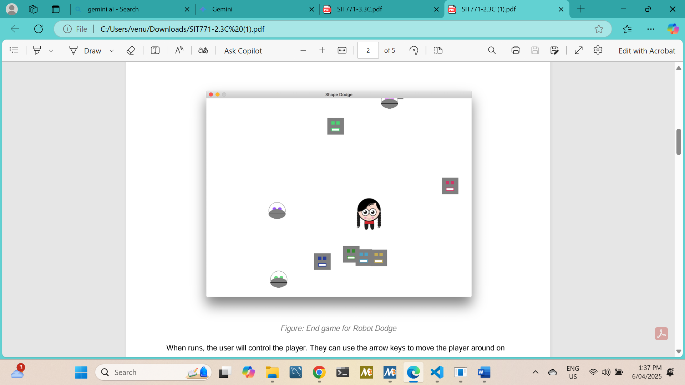
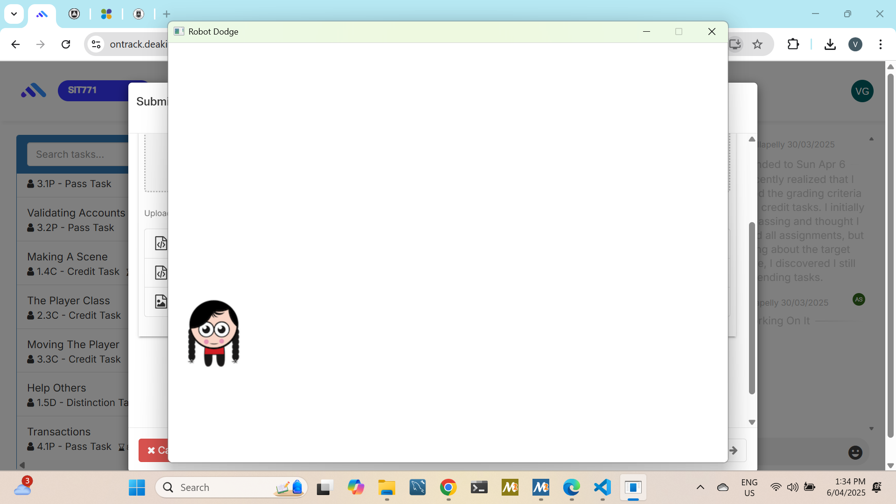
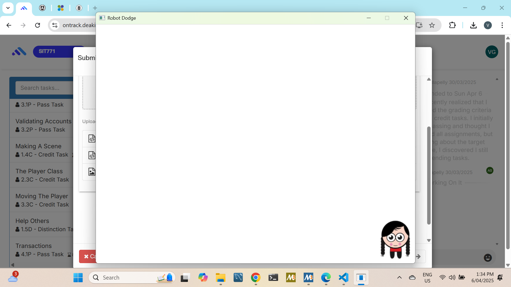

# Robot Dodge Game (C#)

A simple 2D arcade-style game built using C# and SplashKit, where the player avoids incoming robots and survives as long as possible.

## 🎮 Gameplay Overview
- Control a player character on the screen
- Robots spawn and move towards the player
- Player must dodge robots to survive
- Score increases based on survival time

## 🛠️ Technologies Used
- C#
- SplashKit SDK
- Object-Oriented Programming (OOP)

## 🧩 Key Concepts Demonstrated
- Classes and objects
- Inheritance and polymorphism
- Game loop and collision detection
- Resource management
- Event handling

## ▶️ How to Run
1. Open `RobotDodge.sln` in Visual Studio
2. Ensure SplashKit is installed
3. Build and run the project

## 📚 Academic Context
This project was developed as part of coursework to practice object-oriented programming and game development fundamentals.

## 📸 Screenshots

